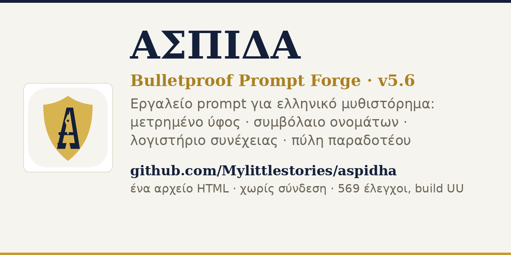

# 🛡️ ΑΣΠΙΔΑ — Bulletproof Prompt Forge

**v5.6 · build UU · 2026-09-22** — ένα αρχείο HTML (≈800 KB), φωτεινή διεπαφή, χωρίς σύνδεση, χωρίς εξαρτήσεις, χωρίς εγκατάσταση.

[](https://github.com/Mylittlestories/aspidha/releases)
[](tools/verify.js)
[](LICENSE)




---

## Τι είναι

Το **ΑΣΠΙΔΑ** δεν γράφει τη νουβέλα σου. Φτιάχνει το **prompt** που κάνει μια μηχανή (ChatGPT,
Claude, Gemini, τοπικό μοντέλο) να τη γράψει **όπως τη θέλεις εσύ** — και ύστερα **ελέγχει το
αποτέλεσμα με μέτρα, όχι με γούστο**.

Είναι φτιαγμένο για ελληνικά: κλίσεις, τυπογραφία, ρυθμός, στιχομυθία, ονόματα που δεν
θυμίζουν ταινία ή μυθιστόρημα. Δουλεύει εξ ολοκλήρου στον υπολογιστή σου — δεν στέλνει τίποτε
πουθενά, δεν έχει τηλεμετρία, δεν ζητά λογαριασμό. Κατέβασέ το και δουλεύει για πάντα.

**Πρόβλημα που λύνει:** οι μηχανές γράφουν όλες με τον ίδιο τρόπο — επίπεδες παράγραφοι, μέσος
όρος, προβλέψιμες εικόνες, ονόματα-κλισέ, ξαφνικά «τέλος» στη μέση. Το ΑΣΠΙΔΑ βάζει στο prompt
τα δεσμευτικά που λείπουν: **μετρημένο ύφος** (δείγμα, όχι περιγραφή), **συμβόλαιο ονομάτων**
(κλειδωμένα, με τις κλίσεις τους), **ποσοστώσεις ρυθμού**, **γραμμή συνέχειας** για το επόμενο
κεφάλαιο, και **τελικό αυτοέλεγχο**.

---

## Τι νέο στη v5.6

**Οι οδηγίες συνέχειας ανά κεφάλαιο βγαίνουν πλέον από το εργαλείο.** Αυτό που έμενε στον
συγγραφέα — ποιο κεφάλαιο θέλει δουλειά, πόσες λέξεις λείπουν, με τι ρυθμό, τι πρέπει να μείνει
όπως είναι — το μετρά η Πύλη Παραδοτέου και το γράφει εκείνη, σε ένα μπλοκ ανά κεφάλαιο:

- **Κουμπί «📝 Οδηγίες συνέχειας ανά κεφάλαιο»** στην κάρτα της Πύλης. Διαβάζει το χειρόγραφο που
  έχεις επικολλήσει και μετρά κάθε ενότητα χωριστά: λέξεις/στόχο, παράγραφο-αναπνοή, ρυθμό,
  πρόσωπο, χρόνο, διάλογο, κύρια ονόματα.
- **Ταξινόμηση κατά έλλειμμα.** Πρώτο το κεφάλαιο με τη μεγαλύτερη απόκλιση — το πρώτο κλικ
  πιάνει το χειρότερο, όχι ό,τι τύχει.
- **Κάθε μπλοκ στέκει μόνο του.** «Έχεις δώσει 183 λέξεις από τις 600. Γράψε ακόμη 417 λέξεις
  ΤΗΣ ΙΔΙΑΣ ΣΚΗΝΗΣ — όχι σύνοψη, όχι νέα σκηνή, όχι επανάληψη.» Δίπλα: το πρόσωπο και ο χρόνος
  της πλειονότητας του έργου (με οδηγία επιστροφής, αν η ενότητα ξέφυγε), η παράγραφος-αναπνοή
  με τον κανόνα της, ο ρυθμός με το μέτρο του συμβολαίου (≈13,6 λέξεις/πρόταση) και το μετρημένο
  νούμερο της ενότητας, το ποσοστό διαλόγου, τα κλειδωμένα ονόματα, ο κανόνας κλεισίματος.
- **Γραμμή συνέχειας με την ταυτότητα της ενότητας.** «ΚΑΤΑΣΤΑΣΗ: **κεφάλαιο τρίτο**
  ολοκληρωμένο · επόμενη σκηνή: …» — όχι η τελευταία λέξη του τίτλου, και με τους τόνους
  σωστούς στα πεζά.
- **Τρία κουμπιά:** αντίγραφο, κατέβασμα `.md`, και «➡ Μπλοκ οδηγιών στο κείμενο» που το ρίχνει
  στο πεδίο του χειρογράφου — μία φορά (δεύτερο κλικ δεν διπλογράφει).
- **Όταν όλα πιάσουν τον στόχο, το λέει.** «✓ ΔΕΝ ΕΚΚΡΕΜΕΙ ΣΥΝΕΧΕΙΑ» με τα κλειδωμένα ονόματα
  υπενθύμιση — το εργαλείο δεν επινοεί δουλειά για να φανεί χρήσιμο.

---

## Τι νέο στη v5.5

Δοκιμή σε **όλα τα ολοκληρωμένα έργα του συγγραφέα** (Η ΟΦΕΙΛΗ 18.299 λέξεις · Η ΑΠΟΔΕΙΞΗ 13.660 ·
ΤΟ ΞΕΒΓΑΛΜΑ · ΤΟ ΑΚΟΥΣΜΑ · ΕΚΘΕΣΗ ΑΥΤΟΨΙΑΣ · κ.ά.) — και τα ευρήματα της δοκιμής μπήκαν μέσα στο
εργαλείο, ώστε να μην ξαναγίνουν:

- **Το πρόσωπο αφήγησης μετριέται ΜΟΝΟ στην αφήγηση.** Ο διάλογος μιλά σε πρώτο πρόσωπο ακόμα κι
  όταν η ιστορία είναι τρίτο («—Πού πας; —Πάω σπίτι»). Πριν, κάθε μυθιστόρημα με ζωντανή
  στιχομυθία «άλλαζε πρόσωπο» — ψευδής καταγγελία. Δύο έργα κατηγορήθηκαν άδικα.
- **Το πρόσωπο φαίνεται στην κατάληξη.** Στα ελληνικά το «δουλεύαμε» είναι πρώτο πληθυντικό χωρίς
  αντωνυμία· το «γύρισε» τρίτο. Μετριούνται και οι καταλήξεις, με λίστα αποκλεισμού ώστε το
  «οκτώ», το «λόγω» και η «αίθουσα» να μη διαβάζονται ως ρήματα.
- **Ένα κεφαλαίο δεν είναι όνομα.** Το «Πήρα τους φακέλους» και το «Γύρισε και κοίταξε» έβγαιναν
  πρόσωπα στο λογιστήριο (η ΟΦΕΙΛΗ είχε 25 «χαρακτήρες» που ήταν ρήματα). Τώρα όνομα είναι ό,τι
  εμφανίζεται και **μέσα** στην πρόταση, όπου το κεφαλαίο δεν εξηγείται αλλιώς.
- **Ένας άνθρωπος, ένα πρόσωπο.** «Ρίτσι», «Μπόουντεν» και «ΡΙΤΣΙ ΜΠΟΟΥΝΤΕΝ» είναι ο ίδιος — το
  εργαλείο ενώνει τις μορφές και μετρά τις εμφανίσεις στο πρόσωπο, με τον σωστό τονισμό.
- **ΜΕΡΗ, ΠΡΑΞΕΙΣ και ΤΟΜΟΙ μετριούνται ως ενότητες.** Το ΞΕΒΓΑΛΜΑ είχε πέντε ΜΕΡΗ και η πύλη
  έλεγε «0 κεφάλαια», δηλαδή δεν έλεγχε τίποτα (ούτε μήκος, ούτε ρυθμό, ούτε πρόσωπο).
- **Το τέλος κρίνεται στην ουρά.** Ασύμμετρα εισαγωγικά στη μέση δεν σημαίνουν «το έργο κόπηκε» —
  δύο έργα τιμωρήθηκαν άδικα με μπλοκαριστικό.
- **Τα εισαγωγικά ελέγχονται με μηχανή καταστάσεων**, ώστε να ξεχωρίζουν δύο διαφορετικά λάθη:
  «κλείνει χωρίς άνοιγμα» (περιττό ») και «ανοίγει χωρίς κλείσιμο» (λείπει ») — καθένα με τη
  γραμμή του. Η παράθεση που απλώνεται σε πολλές παραγράφους **δεν** κατηγορείται.
- **Δύο νέοι έλεγχοι**: ο **ρυθμός που ξεφεύγει** από το συμβόλαιο (≈13,6 λέξεις/πρόταση) — δηλώνεται
  ώστε είτε να διορθωθεί είτε να δηλωθεί ως επιλογή — και η **απότομη αλλαγή υφής στο φινάλε**
  (στην ΑΠΟΔΕΙΞΗ ο διάλογος έπεφτε από 50–72% σε 11% στο τελευταίο κεφάλαιο).
- **Καμία ψεύτικη επιτυχία**: «όλα τα κεφάλαια πιάνουν τον στόχο» λέγεται μόνο όταν υπάρχει έστω
  μία ενότητα με στόχο· αλλιώς το εργαλείο ζητά κεφαλίδες για να μπορέσει να μετρήσει.
- **Δύο πραγματικά λάθη βρέθηκαν στα έργα** (περιττό » στο ΑΚΟΥΣΜΑ, δύο ανοιχτές παραθέσεις στο
  ΞΕΒΓΑΛΜΑ) — διορθώθηκαν στα διορθωμένα αρχεία του φακέλου `ΔΙΟΡΘΩΜΕΝΑ/`.

- **Φωτεινή διεπαφή εξ ορισμού.** Χαρτί (#f6f4ef), λευκές κάρτες, μελάνι (#14203a) — και το
  σήμα ξαναζωγραφισμένο στο ίδιο χαρτί, ώστε εικονίδιο, σελίδα και manifest να μη διαφωνούν.
  Όποιος δουλεύει νύχτα πατά **🌙 Σκοτεινό**: η επιλογή γράφεται στη μνήμη του περιηγητή και
  ξαναδιαβάζεται στο επόμενο άνοιγμα.
- **Πύλη Παραδοτέου** (καρτέλα «Επιμέλεια»). Κολλάς το χειρόγραφο και παίρνεις, με μέτρα:
  ΠΕΡΝΑ / ΠΕΡΝΑ ΜΕ ΠΡΟΣΟΧΗ / **ΔΕΝ ΠΕΡΝΑ**, με έναν λόγο για κάθε εύρημα, πίνακα ανά κεφάλαιο
  (λέξεις, στόχος, μέσο μήκος πρότασης, παράγραφος έξι προτάσεων, διάλογος, πρόσωπο, χρόνος,
  ονόματα), προειδοποιήσεις για αλλαγή χρόνου/προσώπου, ονόματα εκτός συμβολαίου, πρόσωπα που
  χάνονται, και ανοιχτό τέλος. Ένα κλικ γυρίζει τα ευρήματα **μέσα στο prompt** ως οδηγία
  διόρθωσης· άλλο κλικ κατεβάζει την έκθεση σε Markdown.
- **Διόρθωση που προστάτεψε κείμενο.** Το κόψιμο του πρωτοκόλλου σταματά πλέον εκεί που
  τελειώνει το πρωτόκολλο: πριν, μια μέτρηση στη μέση του έργου έσβηνε από τη μέτρηση ό,τι
  ακολουθούσε. Τώρα το επόμενο κεφάλαιο μετριέται ολόκληρο, και το πρωτόκολλο που βρέθηκε μέσα
  στο σώμα δηλώνεται ως προειδοποίηση — δεν κρύβεται και δεν σβήνει τίποτε.
- **Η σειρά έκδοσης επιστρέφει στο 5.x.** Η αρίθμηση «v28.0» αποσύρεται· η v5.4 είναι η επόμενη
  της v5.3. Το αρχείο δεν αναφέρει κανένα άλλο πρόγραμμα — ο έλεγχος «ανεξαρτησία» το
  επαληθεύει σε κάθε push.

---

## Γρήγορη εκκίνηση

**1. Άνοιξέ το τώρα** — <https://Mylittlestories.github.io/aspidha/> (GitHub Pages).

**2. Κατέβασέ το** — πάρε το [`index.html`](index.html) (ή το ίδιο αρχείο ως
[`writing-prompt-generator.html`](writing-prompt-generator.html)) και άνοιξέ το με διπλό κλικ.
Δεν χρειάζεται διακομιστής, ούτε internet: το αρχείο είναι αυτοτελές.

**3. Από το αποθετήριο**

```bash
git clone https://github.com/Mylittlestories/aspidha.git
cd aspidha && xdg-open index.html      # macOS: open index.html
```

> Το αρχείο είναι **ένα** και αυτοτελές. Τα `assets/` υπάρχουν για το README, το og-image και
> τα εικονίδια του αποθετηρίου — η εφαρμογή δεν τα ζητά ποτέ. Μπορείς να κρατήσεις μόνο το
> `index.html` και να σβήσεις τα υπόλοιπα.

---

## Τι κάνει — έξι καρτέλες

| Καρτέλα | Τι κάνει |
|---|---|
| 🎛 **Σφυρηλάτηση Prompt** | Συνθέτει το πλήρες prompt: σύστημα, προδιαγραφές έργου, ονοματολογία, κόσμος, ύφος, πύλη ποιότητας, αντιανίχνευση, λογιστήριο συνέχειας. Τρεις βαθμίδες μεγέθους με βαθμονομημένη μέτρηση tokens. |
| 🏷 **Name Forge** | Ονόματα που ταιριάζουν στο είδος και στο **πλαίσιο ονοματοδοσίας** που διαλέγεις — φωνολογία, κλίσεις, έλεγχος ομοιότητας με γνωστά έργα. Η κλήρωση αλλάζει σε κάθε πάτημα. |
| 🔍 **Έλεγχος Κειμένου** | Μετρά το γραμμένο σου: ρυθμό και κατανομή μήκους πρότασης, παράγραφο-οβίδα, λέξεις-καπνό, επαναλήψεις, στιχομυθία χωρίς στήριγμα, ετυμολογία, δάνεια από το δείγμα, απόσταση από τη φωνή-στόχο. |
| 🌍 **Κόσμος** | Δώδεκα στρώματα κόσμου (τόπος, τεχνολογία, θεσμοί, οικονομία, γλώσσα, μύθος…) με έλεγχο συνέπειας. |
| 📚 **Λογιστήριο Συνέχειας** | Κεφάλαιο, σύνοψη, πρόσωπα με κλίσεις, αντικείμενα-κλειδιά, νήματα. Ό,τι δηλώσεις, το ξέρει το prompt κάθε φορά — και κόβεται **δηλωμένα**, ποτέ σιωπηλά. |
| ✒️ **Επιμέλεια** | Καθαρογράφημα, επτά περάσματα επιμέλειας, φύλλο ύφους, έλεγχος συμβολαίου ονομάτων, φύλλο προόδου, εξαγωγή αναφοράς. |

Ενδιάμεσα: 🥁 ποσοστώσεις ρυθμού (13,6 λέξεις/πρόταση · 45–55% κάτω από 10) · 🎯 δάνεια από το
χρυσό δείγμα · 💬 πειθαρχία διαλόγου (ετικέτες, κίνηση) · ✍️ ελληνική τυπογραφία · ♻️ ανακύκλωση
φράσεων · 🪨 συμπαγές prompt (λιγότερα tokens, ίδια δέσμευση) · αντιγραφή με τρεις εφεδρείες ·
μνήμη έργου · ιστορικό · σώμα κειμένων (αναζήτηση μες στο σώμα κειμένων σου).

---

## Η πειθαρχία του πρωτοκόλλου

- **Χρυσό δείγμα ύφους** — τρεις φωνές (στεγνό/εσωτερικό/κινηματικό), δύο-τρεις παράγραφοι
  γραμμένες για το εργαλείο. Το prompt δεν **περιγράφει** το ύφος· το **δείχνει** και απαγορεύει
  το δάνειο περιεχομένου. Όταν το περιθώριο στενεύει, το δείγμα **μαζεύει** σε μικρή δόση —
  και μόνο σε ακραία περίπτωση φεύγει, δηλωμένα.
- **Τρεις βαθμίδες** — `Πλήρες` ≈35.000 χαρ. (≈15.800 tokens o200k) · `Μεσαίο` ≈15.000 (≈6.800) ·
  `Ελάχιστο` ≈7.700 (≈3.470). Ο επόπτης μεγέθους κόβει με σειρά προτεραιότητας (φάκελος →
  λογιστήριο → συμβόλαιο λόγια → δείγμα τελευταίο) και **δηλώνει** τι έκοψε.
- **Συμβόλαιο ονομάτων** — όσα κλειδώνεις μένουν, με όλες τις πτώσεις· ό,τι άλλο κύριο όνομα
  απαγορεύεται. Το εργαλείο μπορεί να **υιοθετήσει** τα ονόματα που βρήκε στο κείμενό σου με
  ένα κλικ, και δεν τα σβήνει η επόμενη κλήρωση.
- **Γραμμή συνέχειας** — το τέλος κάθε κεφαλαίου μεταφέρει κατάσταση, τελευταία περίοδο και
  επόμενη σκηνή: το επόμενο κεφάλαιο ξεκινά χωρίς επανεκκίνηση και χωρίς κύκλους.
- **Μέτρηση έξω από το κείμενο** — η μέτρηση λέξεων ζητείται κάτω από δική της ένδειξη, με κενή
  γραμμή, ώστε να μη μπει ποτέ μέσα στο χειρόγραφο.
- **Πύλη Παραδοτέου** — το τελευταίο φίλτρο πριν από τον εκδότη: μέτρα ανά κεφάλαιο, συμπέρασμα
  με λόγο, και οδηγία διόρθωσης που γυρίζει στο prompt με ένα κλικ.
- **Φως ή σκοτάδι** — φωτεινή διεπαφή εξ ορισμού (χαρτί), σκούρη με ένα πάτημα, με μνήμη.

---

## Γιατί να το εμπιστευτείς

- **569 έλεγχοι, 0 αποτυχίες, σε 50 ενότητες.** Η σουίτα ανάπτυξης (`rev.js`) ελέγχει τη
  συμπεριφορά του εργαλείου σε εικονικό περιβάλλον: ριπές σφυρηλάτησης, όρια προϋπολογισμού,
  καταπόνηση με γεμάτο λογιστήριο, ψευδο-θετικά του ελέγχου κειμένου, συμβόλαιο ονομάτων,
  τυπογραφία — και δύο ενότητες που δοκιμάζουν **χειρόγραφα που ξέρουμε την αλήθεια τους**:
  ένα καθαρό τρίπτυχο κεφαλαίων (περνά, με 8 επαληθεύσεις) και ένα χαλασμένο (κοντό κεφάλαιο,
  αλλαγή χρόνου, χωρίς παράγραφο-αναπνοή, κομμένη φράση) που **δεν περνά**.
- **Ο έλεγχος δεν λέει ψέματα.** Κάθε εύρημα του «Ελέγχου Κειμένου» έχει μετρημένο δείκτη και
  παράδειγμα· ό,τι δεν στέκει, το κυνήγησα και το έκλεισα (ψευδή «εκτός συμβολαίου», «παράγραφος
  χωρίς τελική στίξη» σε εισαγωγές με «:», ετυμολογία με άρνηση, οβίδα/στακάτο μόνο στην αφήγηση).
- **Τα pixel του σήματος μετριούνται.** Το CI αποκωδικοποιεί τα ενσωματωμένα PNG, ελέγχει
  διαστάσεις και ότι το χρυσό σχήμα υπάρχει στα 16/32/192 px — δεν «περνά» άδειο εικονίδιο.
- **Καμία φόρτωση από το δίκτυο.** Ένα `href` προς αυτό το αποθετήριο είναι σύνδεσμος· δεν είναι
  εξάρτηση. Το CI το ελέγχει: μηδέν `src`, μηδέν stylesheet, μηδέν `@import`.

Τρέξε τους ελέγχους μόνος σου:

```bash
node tools/verify.js            # 29 δομικοί έλεγχοι (χωρίς εξαρτήσεις)
```

---

## Δομή αποθετηρίου

```
index.html                     η εφαρμογή — ΟΛΟΚΛΗΡΟ το εργαλείο, ένα αρχείο, offline
writing-prompt-generator.html  το ίδιο αρχείο (ιστορικό όνομα, ίδιο περιεχόμενο)
manifest.webmanifest           για «προσθήκη στην αρχική» όταν σερβίρεται ως ιστοσελίδα
assets/                        το σήμα (SVG + PNG 16/32/180/192/512), banner, og-image
tools/verify.js                δομικός έλεγχος (29 έλεγχοι) — τρέχει στο CI
.github/workflows/verify.yml   CI: έλεγχος σε κάθε push
CHANGELOG.md                   τι άλλαξε, έκδοση προς έκδοση
LICENSE                        MIT © 2026 George Derventlis
```

---

## Όρια, ειλικρινά

- **Είναι εργαλείο γραφής, όχι συγγραφέας.** Χωρίς δικό σου κείμενο, το prompt δίνει ένα καλό
  πρώτο κεφάλαιο — όχι βιβλίο. Η αξία του φαίνεται στο δεύτερο κεφάλαιο και μετά, με λογιστήριο.
- **Το «Ελάχιστο» είναι συμβιβασμός.** Ό,τι κόβεται για να χωρέσει σε 8k tokens δηλώνεται· σε
  μικρό παράθυρο ζήτα **ένα κεφάλαιο τη φορά** (≥1.500 λέξεις), όπως το ζητά και το prompt.
- **Οι μετρήσεις ύφους είναι στόχοι, όχι κριτήρια λογοτεχνίας.** Ρυθμός και ποσοστά βγαίνουν από
  μετρημένα κείμενα· δεν αντικαθιστούν την κρίση σου — την ελευθερώνουν από τα μηχανικά λάθη.
- **Το UI και τα κείμενα είναι στα ελληνικά.** Τα ονόματα των πεδίων είναι ελληνικοί όροι· δεν
  υπάρχει αγγλική μετάφραση της διεπαφής.

---

## English (short)

**ΑΣΠΙΔΑ (Aspidha) — Bulletproof Prompt Forge** is a single-file, offline prompt studio for
novelists writing in Greek. It forges a zero-drift prompt for any AI model (system directive,
project spec, onomastics contract, world building, voice DNA, quality gate, anti-detection
checks, continuity ledger), then **measures** what came back: sentence-length distribution,
paragraph shape, repetition, dialogue discipline, etymology, leakage from the style sample, and
distance from your target voice. No installation, no build step, no network calls, no telemetry —
download `index.html` and open it. Written for Greek orthography and morphology (cases, accent
shift, punctuation). Text and interface are in Greek.

- Live: <https://Mylittlestories.github.io/aspidha/> · Windows/macOS/Linux · any modern browser
- Verified: 569 development checks, 0 failures · 29 structural checks in CI
- License: MIT © 2026 George Derventlis

---

## Άδεια & αναφορές

MIT — δες [LICENSE](LICENSE). Χρήση ελεύθερη, με αναφορά.

Το εργαλείο χτίστηκε μελετώντας **τεχνική**, όχι αντιγράφοντας κείμενα: καταγραφές για ρυθμό
πρότασης και ύφος, οδηγίες ονοματοδοσίας φανταστικών κόσμων, δοκίμια για τη σχέση ύφους και
μηχανής, και μετρημένα ελληνικά κείμενα. Κανένα δάνειο δεν μπαίνει στο κείμενο του χρήστη: το
χρυσό δείγμα είναι γραμμένο για το εργαλείο και το prompt απαγορεύει ρητά το δάνειό του.

Ερωτήσεις, ιδέες, λάθη: άνοιξε **issue** στο αποθετήριο. Αν βρεις ψευδές εύρημα στον έλεγχο
κειμένου, γράψε το απόσπασμα — είναι ο μόνος τρόπος που διορθώνεται.
